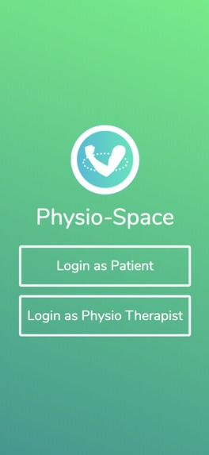
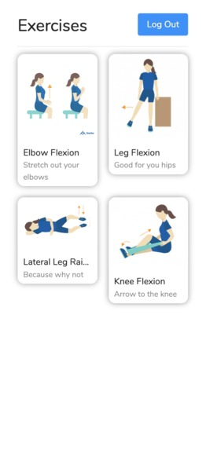
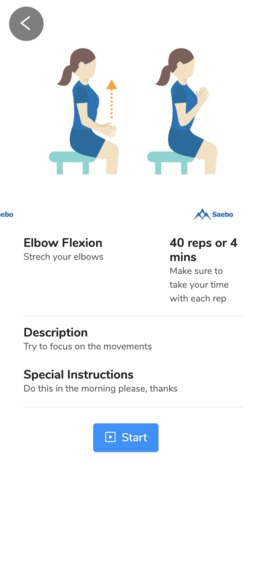
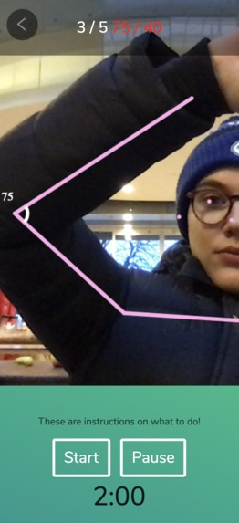

# Physio Space
The Physio that’s always at your side

## Team members
 - Sophie - Team Lead & Front-end Developer
 - Liang - Back-end & Front-end Developer
 - Adel - Back-end & Front-end Developer
 - Stephanie - Designer
 - Alice - Designer
 - Jacky - Back-end Developer
 - Bebo - Back-end & Front-end Developer
 - Michael - Front-end Developer
 - Scarlet - Front-end Developer
 - Sergei - Back-end Developer

## The Problem
A specific application of physiotherapy is that joint movement may get limited through muscle atrophy, surgery, accident, stroke or other causes. Reportedly, up to 70% of patients give up physiotherapy too early — often because they cannot see the progress. Automated tracking of ROM via a mobile app could help patients reach their physiotherapy goals.
 
Insurance studies showed that 70% of the people are quitting physiotherapy sessions when the pain disappears and they regain their mobility. The reasons are multiple, and we can mention a few of them: cost of treatment, the feeling that they recovered, no more time to dedicate for recovery and the loss of motivation. The worst part is that half of them are able to see the injury reappear in the course of 2-3 years.
Current pose tracking technology is NOT realtime and automatic, requiring the need for physiotherapists on hand and expensive tracking devices. Although these work well, there is a HUGE room for improvement to develop a cheap and scalable solution.
 
Additionally, many seniors are unable to comprehend current solutions and are unable to adapt to current in-home technology, let alone the kinds of tech that require hours of professional setup and guidance, as well as expensive equipment.
 
## Our Solution
Our solution only requires a device with a working internet connection!! We aim to revolutionize the physiotherapy industry by allowing for extensive scaling and efficiency of physiotherapy clinics and businesses. We understand that in many areas, the therapist to patient ratio may be too high to be profitable, reducing quality and range of service for everyone, so an app to do this remotely is revolutionary.
 
We collect real-time 3D position data of the patient's body while doing exercises for the therapist to adjust exercises using a machine learning model directly implemented into the browser, which is first analyzed within the app, and then provided to a physiotherapist who can further analyze the data.

It also asks the patient for subjective feedback on a pain scale
This makes physiotherapy exercise feedback more accessible to remote individuals WORLDWIDE from their therapist.
 
Check out this link for a project demo: https://youtu.be/gNtLn0EDFeQ)

## The Tech
### Front-end
@sophie these also need to filled in
The mobile application was developed with *React Native*. We used *insert library name* for the AR, and *library name* for in-app pose detection.
### Back-end
On the back-end, we decided to train our own ML algorithm for pose detection. Our model is based off of the [Stacked Hourglass Network](https://arxiv.org/abs/1603.06937) for 2D Pose estimation from which we extrapolate to 3D using Facebook's [VideoPose3D model](https://github.com/facebookresearch/VideoPose3D). Built with Tensorflow and served with Flask.
### Infra/Cloud
The back-end was hosted on Firebase. (other uses of google cloud? @sophie)

## Final Results
### What we finished
We were able to create a fully functioning React Native application that allows users to access physiotherapy from the comfort of their own home and mobile device. In point form, here are some of the features that were implemented:

1. Tracking of real-time 3D position data
2. Support for multiple exercises
3. Collection of objective quantitative as well as qualitative subjective data from the patient for the therapist
4. Increasing the usability for senior patients by moving data analysis onto the therapist's side

### What we learned
1. How to implement Tensorflow models in React
2. Creating reusable components and styling in React
3. Creating algorithms to analyze 3D space
4. Reimplementing and training an ML model from a paper

### Screenshots of the app
Some screenshots of the app. From left to right: 
1) the splash screen 
2) the list of exercises that a physiotherapist suggests 
3) details for how to do said exercise

 

### AR
The AR component of the application. The app tracks how many reps have been completed for each exercise through a pose detection algorithm.

 

## Challenges
1. Testing in React Native  
    Not a lot of our team members had experience in React Native so getting everything to work with it was difficult to start with.
2. Setting up the ML model to work with the camera using React
3. Getting accurate angle data  
    The few library models we looked at for pose estimation weren't super accurate in giving us angle measurements so we decided to build our own (which also leads to the next point)
4. Training our own ML model  
    A lot of pose estimation papers did not come with code that was able to reproduce its results. One paper that did seem promising was written in Lua and had to be converted to PyTorch which was not an easy task. Eventually
